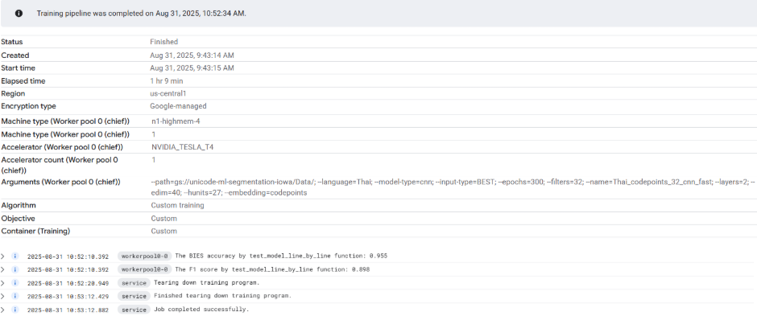
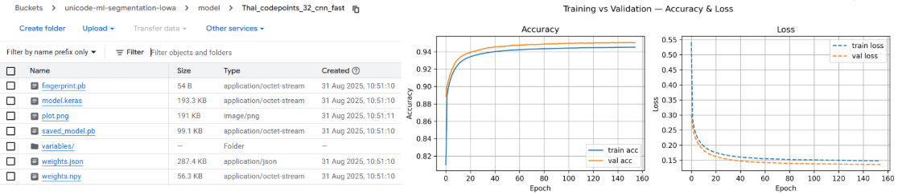
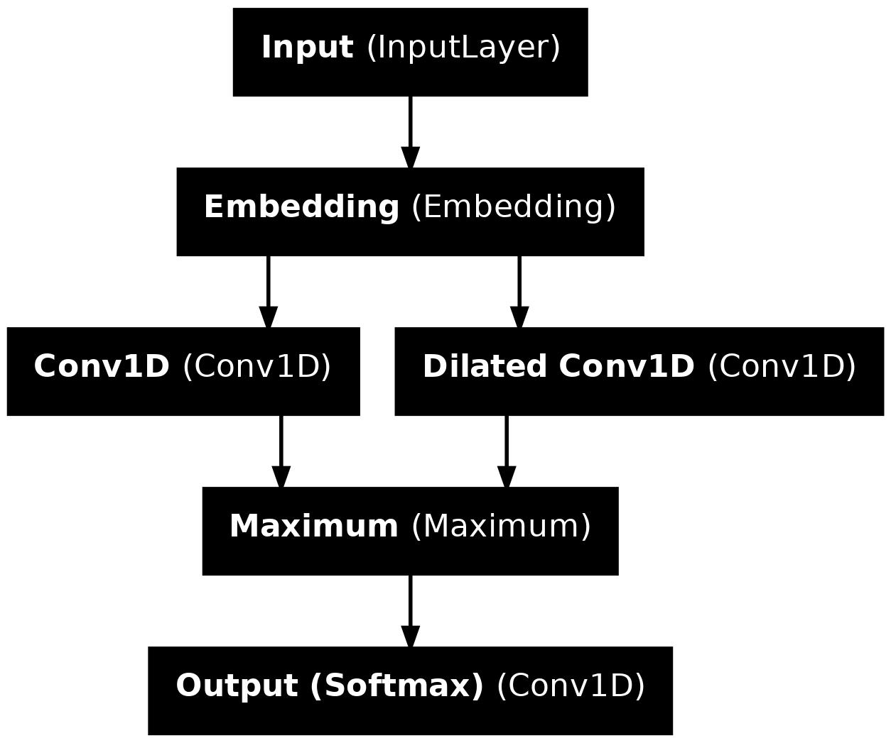

Word segmentation goes from sequential to functional
=====================
Author: **[Zhiyi](https://github.com/opnuub)** \
Mentors: **[Shane](https://github.com/sffc)**, **[Sahand](https://github.com/SahandFarhoodi)**

# Introduction

Word segmentation is a foundational primitive in ICU. Features like line wrapping and word selection often relies on it. The rise of resource-constrained platforms create a need for lightweight segmenter models in ICU4X that maintain desirable accuracy while minimising memory, CPU and battery consumption.

Upon project initiation, the following issues were identified and require resolution:
* Model training of the ML segmentation model requires a painstaking environment setup. 
* The existing LSTM-based segmenter has a linear O(n) time complexity which is not ideal for content-heavy platforms.
* No support for Cantonese, which is a digitally-disadvantaged language.

# Goals and Milestones

To address the aforementioned issues, this project focused on accomplishing the following goals:
* Development of an MLOps pipeline for model training and evaluation 
* Introduction of a new model architecture for faster word segmentation of Southeast Asian languages like Thai and Burmese
* Deployment of a new ML segmentation model for Cantonese

## MLOps Pipeline 

Utilising Google Cloud Platform, the pipeline eases the model training and evaluation process by following these steps:

1. Upon approval, Cloud Build creates a new Docker image of the project repository

2. Given customisable hyperparameters, Vertex AI trains the model and displays metrics such as accuracy and F1 score.

3. Files generated are placed in the Cloud Storage bucket ready for download. 


## Convolutional Neural Networks for Thai



The convolutional neural network (CNN) architecture developed in this project achieved faster inference speeds with comparable accuracy for Thai. Not only was the linear time complexity issue resolved, the usage of dilated convolutions also helped maintain a high level of accuracy by capturing a wider context of the surrounding words.

| Model | F1-Score | Model Size | CPU Inference Speed |
|----------|:--------:|:---------:|---------:|
| LSTM Medium  | 90.1  | 36 KB  | 9.29 ms |
| LSTM Small  | 86.7  | 12 KB  | 6.68 ms |
| CNN Medium | 90.4 | 28 KB | 3.76 ms |
| ICU | 86.4 | 126 KB | ~0.2 ms|

### Examples

**Test Case 1**
| Algorithm | Output |
|----------|:---------|
| Unsegmented | พระราชประสงค์ของพระบาทสมเสด็จพระเจ้าอยู่หัวในรัชกาลปัจจุบันคือ |
| Manually Segmented | พระราชประสงค์_ของ_พระบาทสมเสด็จพระเจ้าอยู่หัว_ใน_รัชกาล_ปัจจุบัน_คือ |
| CNN | พระราชประสงค์_ของ_พระบาทสมเสด็จพระเจ้าอยู่หัว_ใน_รัชกาล_ปัจจุบัน_คือ |
| ICU | พระ_ราช_ประสงค์_ของ_พระบาท_สม_เสด็จ_พระเจ้าอยู่หัว_ใน_รัชกาล_ปัจจุบัน_คือ |
| LSTM | พระราชประสงค์_ของ_พระบาทสมเสด็จ_พระเจ้าอยู่หัว_ใน_รัชกาล_ปัจจุบัน_คือ |

**Test Case 2**
| Algorithm | Output |
|----------|:---------|
| Unsegmented | ในขณะเดียวกันผู้ที่ต้องการเงินเพื่อนำไปลงทุนหรือประกอบกิจการอื่นใด |
| Manually Segmented | ใน_ขณะ_เดียว_กัน_ผู้_ที่_ต้องการ_เงิน_เพื่อ_นำ_ไป_ลง_ทุน	_หรือ_ประกอบ_กิจการ_อื่น_ใด |
| CNN | ใน_ขณะ_เดียว_กัน_ผู้_ที่_ต้องการ_เงิน_เพื่อ_นำ_ไป_ลง_ทุน	_หรือ_ประกอบ_กิจการ_อื่น_ใด |
| ICU | ใน_ขณะ_เดียวกัน_ผู้_ที่_ต้องการ_เงิน_เพื่อน_ำ_ไป_ลงทุน_หรือ_ประกอบ_กิจการ_อื่น_ใด |
| LSTM | ใน_ขณะ_เดียว_กัน_ผู้_ที่_ต้อง_การ_เงิน_เพื่อ_นำ_ไป_ลง_ทุน	_หรือ_ประกอบ_กิจการ_อื่น_ใด |

**Test Case 3**

| Algorithm | Output |
|----------|:---------|
| Unsegmented | เพราะเพียงกรดนิวคลีอิคของไวรัสอย่างเดียวก็สร้างไวรัสสมบูรณ์ |
| Manually Segmented | เพราะ_เพียง_กรด_นิวคลีอิค_ของ_ไวรัส_อย่าง_เดียว_ก็_สร้าง_ไวรัส_สมบูรณ์ |
| CNN | เพราะ_เพียง_กรด_นิว_คลี_อิค_ของ_ไวรัส_อย่าง_เดียว_ก็_สร้าง_ไวรัส_สมบูรณ์ |
| ICU | เพราะ_เพียง_กรด_นิ_วค_ลี_อิค_ของ_ไวรัส_อย่าง_เดียว_ก็_สร้าง_ไวรัส_สมบูรณ์ |
| LSTM | เพราะ_เพียง_กรดนิว_คลีอิค_ของ_ไวรัสอย่าง_เดียว_ก็_สร้าง_ไวรัสสมบูรณ์ |

## AdaBoost for Cantonese

Relative to BudouX’s n-gram model, the new radical-based AdaBoost model reaches comparable accuracy with under half the model size. Moreover, despite being trained on only zh-hant data, the radical-based model generalised better, which makes it more suitable to deploy in zh-hant variants such as zh-tw and zh-hk (Cantonese).

**CITYU Test Dataset (zh-hant)**
| Model | F1-Score | Model Size |
|----------|:--------:|:---------:|
| BudouX  | 86.27  | 64 KB  |
| Radical-based  | 85.82  | 31 KB  |
| ICU | 89.46 | 2 MB |

**UDCantonese Dataset (zh-hk)**
| Model | F1-Score | Model Size |
|----------|:--------:|:---------:|
| BudouX  | 73.51  | 64 KB  |
| Radical-based  | 89.76  | 31 KB  |
| [PyCantonese](https://github.com/jacksonllee/pycantonese) | 94.98  | 1.3 MB  |
| ICU | 79.14 | 2 MB |

### Examples

**Test Case 1 (zh-hant)**
| Algorithm | Output |
|----------|:---------|
| Unsegmented | 一名浙江新昌的茶商說正宗龍井產量有限需求量大價格高而貴州茶品質不差混雜在中間根本分不出來 |
| Manually Segmented | 一 . 名 . 浙江 . 新昌 . 的 . 茶商 . 說 . 正宗 . 龍井 . 產量 . 有限 . 需求量 . 大 . 價格 . 高 . 而 . 貴州茶 . 品質 . 不 . 差 . 混雜 . 在 . 中間 . 根本 . 分 . 不 . 出來 |
| Radical-based | 一 . 名 . 浙江 . 新昌 . 的 . 茶商 . 說 . 正宗 . 龍 . 井 . 產量 . 有限 . 需求 . 量 . 大 . 價格 . 高 . 而 . 貴州 . 茶 . 品質 . 不差 . 混雜 . 在 . 中間 . 根本 . 分 . 不 . 出來 |
| BudouX | 一 . 名 . 浙江 . 新昌 . 的 . 茶商 . 說 . 正宗 . 龍井 . 產量 . 有限 . 需求 . 量 . 大 . 價格 . 高 . 而 . 貴州 . 茶品質 . 不差 . 混雜 . 在 . 中間 . 根本 . 分 . 不 . 出來 |
| ICU | 一名 . 浙江 . 新 . 昌 . 的 . 茶商 . 說 . 正宗 . 龍井 . 產量 . 有限 . 需求量 . 大 . 價格 . 高 . 而 . 貴州 . 茶 . 品質 . 不差 . 混雜 . 在中 . 間 . 根本 . 分 . 不出來 |

**Test Case 2 (zh-hk)**
| Algorithm | Output |
|----------|:---------|
| Unsegmented | 點解你唔將呢句說話-點解你同我講，唔同你隔籬嗰啲人講呀？ |
| Manually Segmented | 點解 . 你 . 唔 . 將 . 呢 . 句 . 說話 . - . 點解 . 你 . 同 . 我 . 講 . ， . 唔 . 同 . 你 . 隔籬 . 嗰啲 . 人 . 講 . 呀 . ？ |
| Radical-based | 點解 . 你 . 唔 . 將 . 呢句 . 說話 . - . 點解 . 你 . 同 . 我 . 講 . ， . 唔同 . 你 . 隔籬 . 嗰啲 . 人 . 講 . 呀 . ？ |
| BudouX | 點解你 . 唔 . 將 . 呢句 . 說話 . - . 點解你 . 同 . 我 . 講 . ， . 唔同 . 你 . 隔籬 . 嗰啲人 . 講呀 . ？ |
| ICU | 點 . 解 . 你 . 唔 . 將 . 呢 . 句 . 說話 . - . 點 . 解 . 你 . 同 . 我 . 講 . ， . 唔 . 同 . 你 . 隔 . 籬 . 嗰 . 啲 . 人 . 講 . 呀 . ？ |
| PyCantonese | 點解 . 你 . 唔 . 將 . 呢 . 句 . 說話 . - . 點解 . 你 . 同 . 我 . 講 . ， . 唔同 . 你 . 隔籬 . 嗰啲 . 人 . 講 . 呀 . ？ |

## Cross-Project Contributions

* Reimplemented the word segmenter inference function in Rust for ICU4X

```rust
impl<'l, 'data> BiesIterator<'l, 'data> {
    fn new(segmenter: &'l CnnSegmenter<'data>, input_seq: Vec<u16>) -> Self {
        let l = input_seq.len();
        let embed_zero: MatrixZero<'_, 2> = segmenter.embedding;
        let embed = embed_zero.to_owned();
        let (vocab, edim) = embed.dim();
        let mut x = MatrixOwned::<2>::new_zero([l, edim]);
        for (i, &id) in input_seq.iter().enumerate() {
            let row = (id as usize).min(vocab - 1);
            {
                let row_view = embed.submatrix::<1>(row).unwrap();
                let src = row_view.as_slice();
                let mut row_mut = x.submatrix_mut::<1>(i).unwrap();
                let dst = row_mut.as_mut_slice();
                dst.copy_from_slice(src);
            }
        }
        let x_t = x.as_borrowed();
        let cout = segmenter.cnn_b1.dim();
        let mut y1 = MatrixOwned::<2>::new_zero([l, cout]); // parallel with y2
        conv1d(x_t, y1.as_mut(), segmenter.cnn_w1, segmenter.cnn_b1, 1);

        let mut y2 = MatrixOwned::<2>::new_zero([l, cout]);
        conv1d(x_t, y2.as_mut(), segmenter.cnn_w2, segmenter.cnn_b2, 2);

        let mut maximum = MatrixOwned::<2>::new_zero([l, cout]);
        elementwise_max(y1.as_borrowed(), y2.as_borrowed(), maximum.as_mut());

        let mut probs = MatrixOwned::<2>::new_zero([l, 4]);
        dense_softmax(
            maximum.as_borrowed(),
            probs.as_mut(),
            segmenter.softmax_w,
            segmenter.softmax_b,
        );

        Self {
            _segmenter: segmenter,
            _input_seq: input_seq.into_iter().enumerate(),
            probs,
        }
    }
}
```

## Pull Requests

* https://github.com/unicode-org/icu4x/pull/6877
* https://github.com/unicode-org/lstm_word_segmentation/pull/43

## Future Works

* Contribute to writing the Cantonese segmenter for ICU4X
* Improve the radical-based model to work for all zh-hans/hant/hk/tw variants
